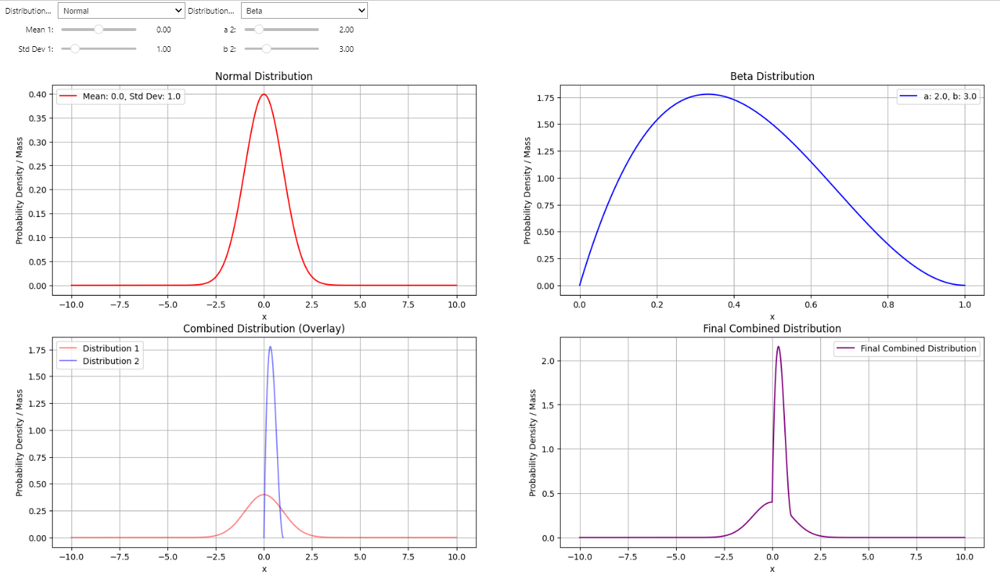
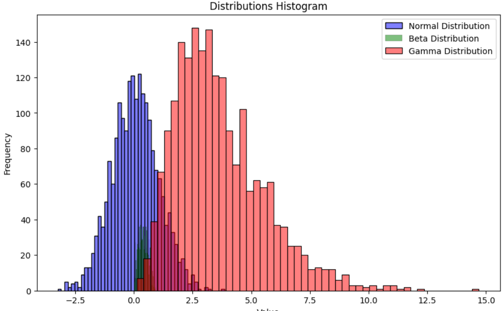
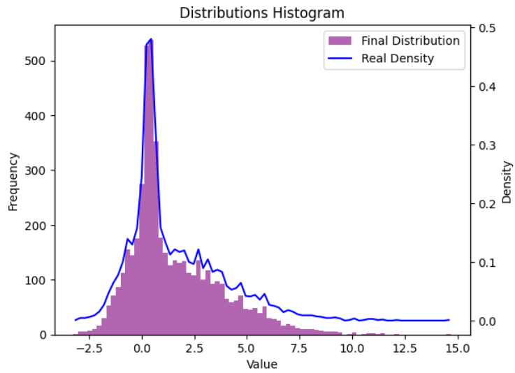
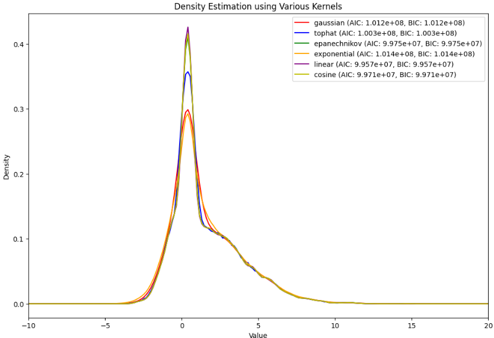
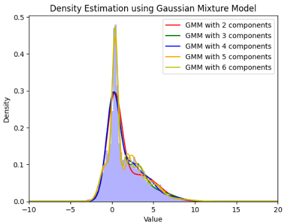

# Density Estimation Techniques

## Overview
This repository contains Python code demonstrating various techniques for density estimation. Density estimation is a technique employed to estimate the probability density function (PDF) of a random variable based on observed data. Essentially, it involves constructing a function that represents the underlying distribution of the data.

The repository allows you to play and combine 2 different distributions and see the results separately.

The repository also shows how 3 different distributions would look after being combined

  
  

 to finally be estimated by several techniques demonstrated.

  
  

## Agenda

1. Create several random densities and merge them into one bizarre density.
2. Use several techniques to reproduce the grouped density.

## Techniques Demonstrated

### 1. Objective Density Creation

Firstly, an interactive graph is provided for learning about distribution parameters. Users can experiment with different distributions and observe the combined result.

After understanding the distribution parameters, three different distributions are created:

- Normal Distribution (`dist1`)
- Beta Distribution (`dist2`)
- Gamma Distribution (`dist3`)

These distributions are then combined into one final distribution (`distf`). Histograms and density plots are generated to visualize the distributions.

### 2. Gaussian Mixture Model (GMM)

GMMs with different numbers of components are fitted to the combined distribution (`distf`). The Bayesian Information Criterion (BIC) and Akaike Information Criterion (AIC) scores are calculated to determine the optimal number of components. The density estimation using GMMs is plotted along with the BIC and AIC scores.

### 3. Gaussian Kernel Density Estimation (KDE)

Kernel Density Estimation is performed using both `scipy.stats.gaussian_kde` and `sklearn.neighbors.KernelDensity`. The density estimation using KDE is plotted for visualization.

### 4. k-Nearest Neighbors (k-NN)

Kernel Density Estimation is performed using various kernel types (`gaussian`, `tophat`, `epanechnikov`, `exponential`, `linear`, `cosine`). For each kernel type, the density estimation is plotted along with the associated AIC and BIC scores.

### 5. Bayesian Methods

A Bayesian model is defined and fitted using `pymc`. Posterior distributions are plotted using `arviz`.

## Usage

To use the code in this repository:

1. Clone the repository to your local machine.
2. Install the required libraries mentioned in `requirements.txt`.
3. Run the Python scripts provided in the repository.
